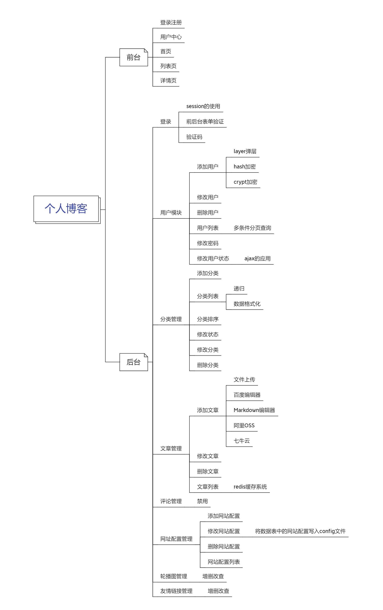
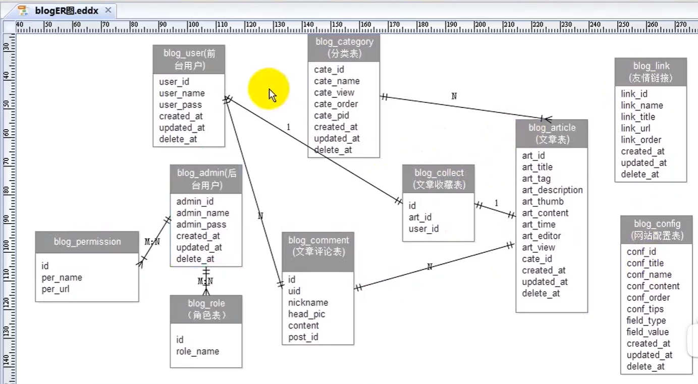
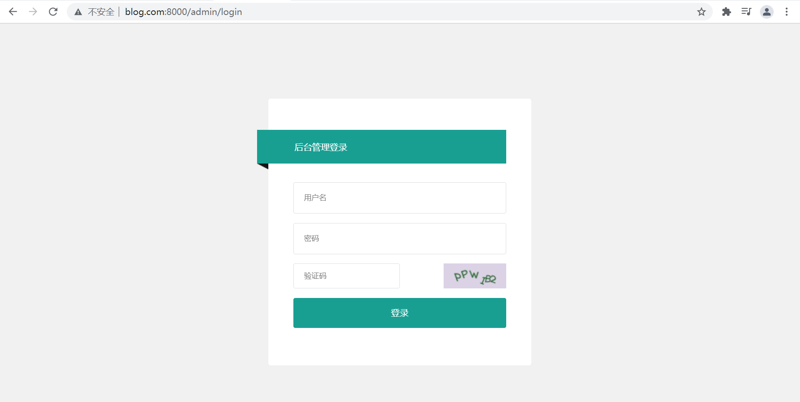
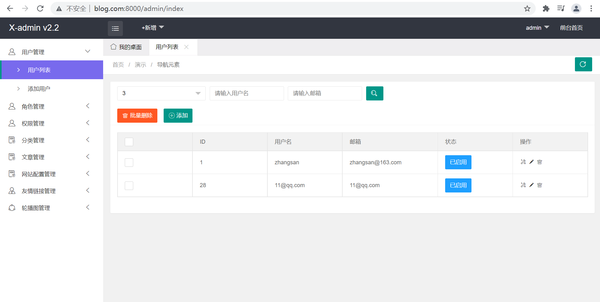
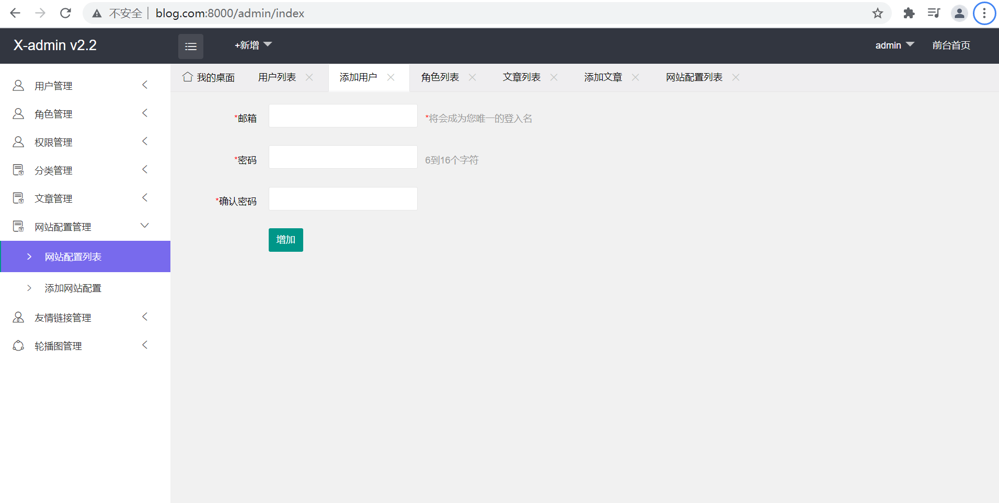
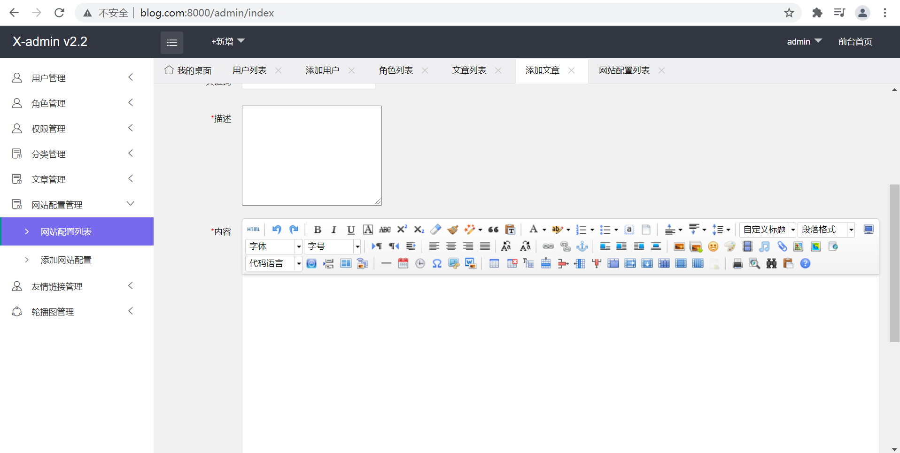
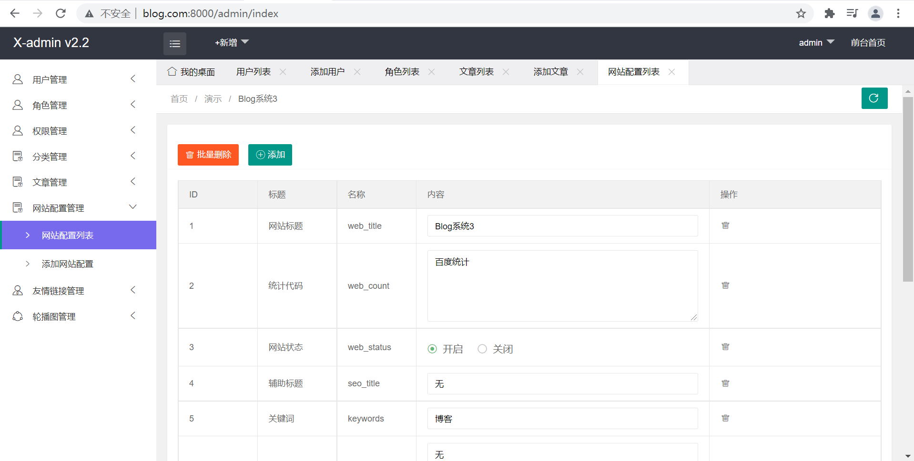

<h1>Laravel5.5 框架项目--博客系统</h1>

 

此项目是观看b站上的转载视频而写的基于Laravel5.5框架的博客项目 
b站上的转载视频地址：https://www.bilibili.com/video/BV1jJ41117fE?p=47 
原讲师：于洪恩 

## 图片展示
- 个人博客需求分析（思维导图）
 
- 数据库
 
- 后台登录页面
 
- 用户列表
 
- 添加用户
 
- 添加文章
 
- 网站配置列表
 

 

## 完成部分

- 后台页面模板嵌套（使用x-admin模板）
- 数据库
- 后台登录页
  用户名，密码，验证码，表单验证
- 用户管理
  包括了对用户的增删改查和授权等功能
- 角色管理
  包括了对角色的增删改查和授权等功能
- 权限管理
  包括了对权限的增删改查等功能
- 分类管理
  有根据cate_order字段排序的功能
- 文章管理：
- ①添加文章：
  使用百度富文本编辑器编辑文章内容
  上传图片、文件到本地 或 上传到七牛云服务器上
- ②文章管理：
  将数据库中Article表中的数据放到redis数据库中，提速
- 网站配置管理
  增删改，批量修改网站配置，将配置写入网站配置文件

 

## 未完成部分

- 前台模板嵌套（没找到模板资源）
- 变量共享
- 首页文章推荐
- 文章收藏
- 发送短信原理
- 短信验证码
- 发送邮件
- 激活账号、忘记密码、找回密码
- 搭建阿里云服务器
- 上传laravel项目并访问

 

## 问题

- 登录页面提示信息的字体大小，位置
- 用户信息的session存留时间问题
- 授权问题，授权设置不太合理，好多都没访问权限，因此暂时将访问权限关闭
- 添加文章的内容和图片不知道怎么添加到数据库中
- 网站配置列表的批量修改的网站状态无法修改
- putContent调用

